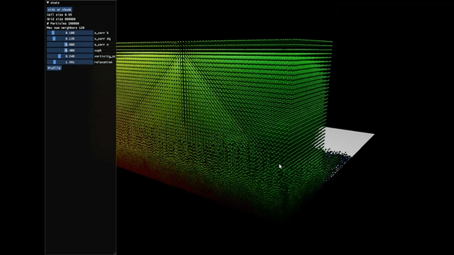
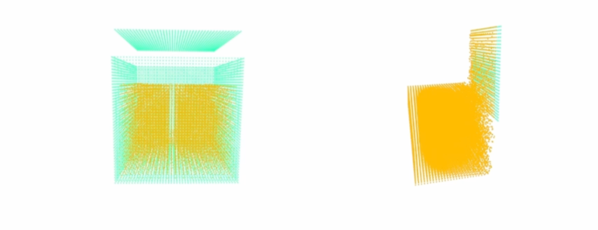
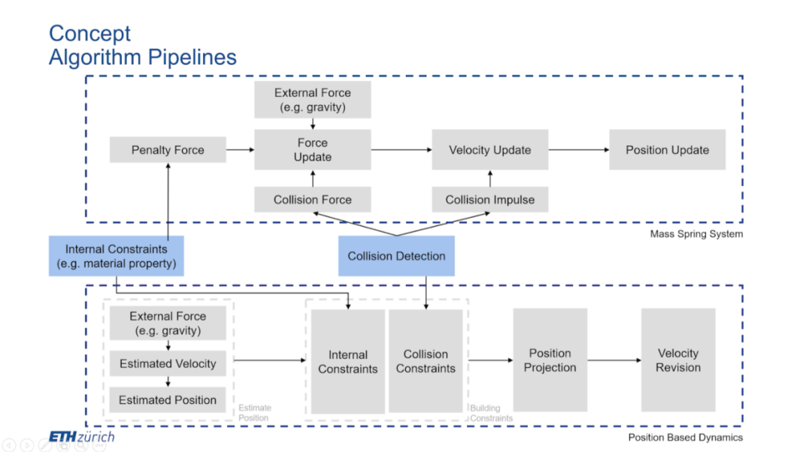
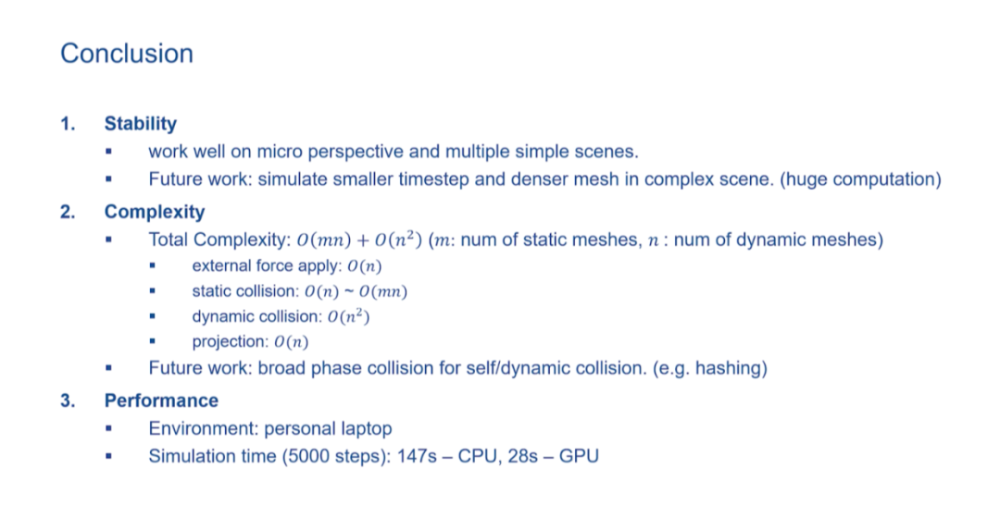
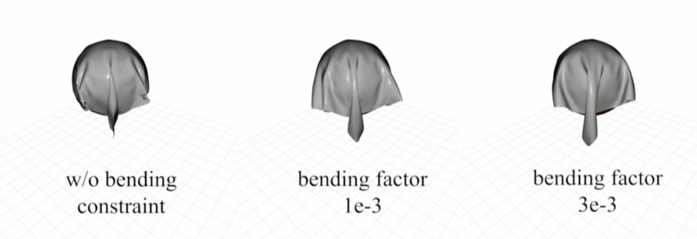
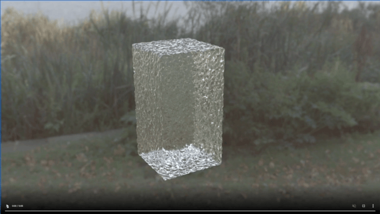
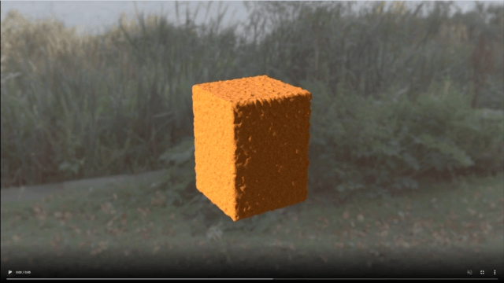
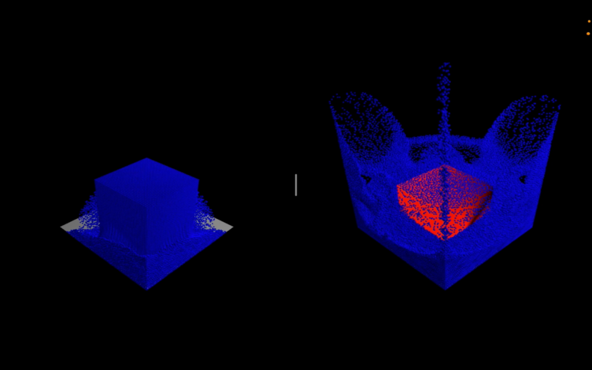
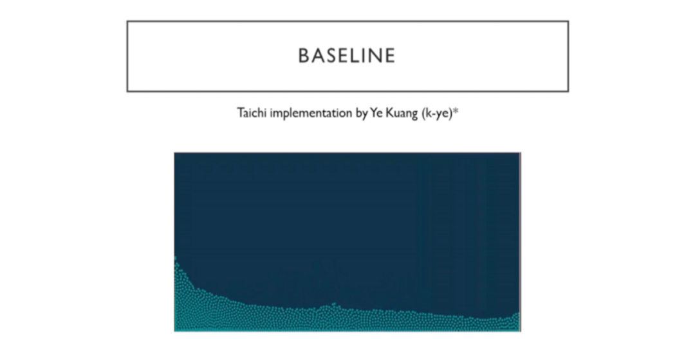

> Taichi, a perfect programming framework for computer graphics courses.

前一阵得知了 ETH Zurich（有 “欧陆第一名校” 美誉的苏黎世联邦理工）的 Computer Graphics Laboratory (CGL) ¹ 去年秋天在教学中使用了 Taichi 进行计算机图形学的教学 ²（内容是 Physically-based Simulation，也就是基于物理的动画）。我们对课上的学生、以及助教（TA）通过 Zoom 进行了访谈。收获很多信息，对 Taichi 未来的发展有很强的指导意义，因此共享出来，和各位开发者一起探讨探讨。（当然也顺便展示一下同学们用 Taichi 创造出了哪些新奇的玩意儿 LOL）

同学们用 Taichi 实现的几个有意思的 simulator，下面会提到

值得一提的是，课程教学人员不但用 Taichi 布置了日常作业，还布置了 final project。Final project 可以使用任何工具和编程语言，不过 90% 的同学选择了 Taichi。

课程进行时，大家使用的 Taichi 是 v0.8.7，但截至本文发布，如今已经快速迭代至 v1.3.0 ³，有些提到的问题已经得到了解决。以下内容来自对同学和助教的访谈结果。

## 助教和同学们的目标

其实也挺简单：**选择一个并行编程语言并用其实现一个基于物理的动画项目，最好是实时的。**

可选的语言：C++ / CUDA / Python (配上 Numpy / PyTorch etc.) 等等。

## 挑战

大家选择框架的时候会重点考虑下面几个问题：

- 物理仿真计算量都挺大，需要并行计算。但是**并行编程的门槛还是蛮高的**。课上的学生很少掌握 GPU 编程（比如 CUDA） ，用 C++ 的话也有较高的门槛。OpenMP 之类的工具也有一些可移植性、性能（和 GPU 比起来）的问题。

- 语言/框架需要自带一些**周边组件**，比如说 3D 可视化，这样才能比较容易地显示、查看结果。因为课程主要内容是物理仿真而不是可视化，大家都**不希望**自己写一套 OpenGL 之类的框架来进行可视化。

学生 3 人组成一组合作，因此必须考虑到语言的**可移植性**。用 CUDA 之类的工具可能有额外的问题：合作伙伴用的是 Mac 或者 AMD 的 GPU，导致自己写的程序到了别的组员那里无法运行，弄不好友谊的小船就这么翻了。C++ 对于特殊硬件的需求小很多，但是也面临着跨平台编译的种种麻烦。

## 为什么学生们选择使用 Taichi？

聊下来我们发现助教和同学比较喜欢 Taichi 如下几个 features：

- Taichi 与 Python 无缝链接，语法相近，而几乎所有同学都掌握 Python。这意味着 Taichi 更容易学习，更加直观。同时，Taichi 拥有与 CUDA 相当的性能。

- Taichi 的 GGUI 系统使得 3D 渲染非常轻松。

- Taichi 非常可移植，如果你的程序编写以后可以比较容易地在 NVIDIA/AMD/Intel 的 GPU、CPU 上运行，就不用担心队友跑不起来，伤害感情...

- Taichi 有一个活跃的社区，并且用户提供了很多示例代码，便于学习。

- ......

## 同学们都用 Taichi 整出了啥？

课程有接近 30 个项目，其中有 90% 的用户都选择了 Taichi。大部分同学获得了比较满意的性能（和 C++、CUDA 比起来），并且代码显著变短了。

我们从所有项目最后的 presentation 视频 ⁴中精选了以下几例讨论讨论~

### Group 6

一个基于 Taichi 开发的的 Position Based Fluids (PBF) 项目。利用 Taichi 和 GGUI 200K 粒子跑出了 60 FPS：

不可压性还有提升空间

该组发现的一个痛点是 GPU sorting。当时 Taichi 确实不支持，需要自己实现，这个同学在 GitHub 也开了个 issue ⁵。后来社区里面一位同学实现了 ⁶。最后的 demo 看着比较简单。

### Group 7

这组挺能打， 在实现过程中还发现了 paper 的一个 bug。用了 BiCGSTAB 来实现最近的一个 SIGGRAPH paper，SPH for snow (Gissler et al. 2020)。

### Group 15

这组也挺能打，用 Taichi 实现了流固耦合：

### Group 16

这组同学用 Taichi 实现了 3D 的布料仿真，整挺好：

### Group 19

Highlight 一下几个中国同学写的项目：SandyFluid ⁷，用 Taichi 实现了 PIC/APIC/FLIP，欢迎大家关注。

### Group 22

另一组做 PBF 的（PBF 真受欢迎啊...是不是课上重点讲了）。

### Group 24

基于 k-ye 的 2D PBF 实现了 3D 版本，致敬一下

这组比较有艺术细胞，写了 3D PBF 然后还导出渲染了个小视频：

牛奶+咖啡混合的模拟，更多细节大家去看他们的 presentation 吧~

## 助教怎么说？

助教同学表示，以往学生需要基于 C++ framework，和别的东西连接 overhead 特别大，脚手架代码很多，因此不管是助教出作业还是学生完成作业，都有些束手束脚。几年前的作业是复现比较简单的算法，如 rigid body, FLIP 等。

**今年用了 Taichi 以后，生产力有了较大提升，可以做一些更复杂的算法了**。最终项目也变成了 “reimplement recent papers”， 给了学生一个 paper list，让他们自己玩去了。**另外 Taichi 的自动微分功能也免去了一些同学导数 “怎么算也算不对” 的难题**。

整体用户体验还是相当棒的，但是一些问题也是存在的（文章末尾会提到）。不过大家还是很看好 Taichi 未来的发展。

## 不足之处与未来发展

虽然上面提到了用 Taichi 的很多优势，但是一些问题依然存在。好在都是通过开发能够解决的问题，有一些也在最新版本中已经解决了。提到比较频繁的问题有如下几个：

- **Syntax error** 质量依然是大家很在乎的 feature，不过根据这次调查，用户体验已经比之前好很多了，但是还需要进一步提升。

- **编译速度**需要提升。一个简单的方式是 Cache，需要实现 IR serialization/deserialization。学生用户往往会有快速迭代的需求，每次改一点点程序，都要等几秒他们还是体验不太好的。当然这一点社区已经在实现了，相关 issue 可复制文末链接查看 ⁸。

- 不确定 Taichi 和 CUDA 等语言比起来性能如何，需要更加完善的性能评测数据。我们在 1.0 发布的同时也公布了非常系统的**性能评测数据** ⁹。Taichi 通常与 CUDA 拥有差不多的性能，但是有时也会更快或者更慢。当然，代码一般都是短不少的。

与 CUDA、JAX、C++ 等工具的性能对比，Taichi 和 CUDA 基本性能一致

- **可视化功能** (GGUI etc.) 可以继续加强，需要画线等功能。也有同学抱怨 v0.8 版本的 Taichi 在 Mac 上不支持 GGUI，造成了一些不便。我们在 v0.9 的时候已经解决了这个问题。

- **单线程模式**（serial mode）：有的时候顶层的 for 循环不希望被并行。之前的解决方案是在 for loop 外面套一个 “if 1:”，但是看着有点丑。目前这一点已经系统解决 ¹⁰。

- **二阶导数**。在计划之中了...

- 还有很多很多我们想解决的问题，欢迎大家加入社区 ¹¹一起开发！

## 没有用 Taichi 的同学是因为什么呢？

助教提到 30 组同学中有两组同学并没有使用 Taichi。有一个用了 Numpy，原因是需要 direct solver，当时 Taichi 确实还不支持（现在支持了：Sparse linear solver ¹²）。还有一组要用到二阶导数，所以用了 PyTorch。二阶导数的功能 Taichi 正在开发过程中。

基础软件的开发一定是不容易的。我们一方面为取得的每一份小小的成功欢欣鼓舞，另一方面也会关注到需要解决的问题，把事情做得更好。Taichi 开发者社区，加油！

## Reference

1.<https://cgl.ethz.ch/>
2.<https://cgl.ethz.ch/teaching/simulation21/fame.php>
3.<https://github.com/taichi-dev/taichi/releases/tag/v1.0.0>
4.<https://cgl.ethz.ch/teaching/simulation21/fame.php>
5.<https://github.com/taichi-dev/taichi/issues/3764>
6.<https://github.com/taichi-dev/taichi/pull/3790>
7.<https://github.com/ethz-pbs21/SandyFluid>
8.<https://github.com/taichi-dev/taichi/issues/4401>
9.<https://github.com/taichi-dev/taichi_benchmark>
10.<https://github.com/taichi-dev/taichi/issues/4421>
11.<https://github.com/taichi-dev/taichi>
12.<https://docs.taichi.graphics/lang/articles/sparse_matrix#sparse-linear-solver>